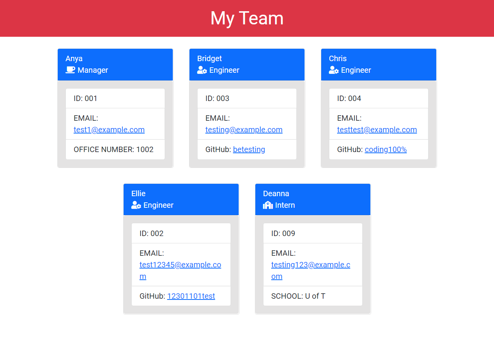

# Team Profile Generator

## Description
An application that generates a webpage of team member contact information based on input from the user. Takes in the team member's name, role, id, and, depending on the role, office number, github or school.

Table of Contents |
-------------------|
[Installation](#Installation)
[Usage](#Usage)
[Contributing](#Contributing)
[Tests](#Tests)
[Questions](#Questions)

 

## Installation

In order to run the project locally, ensure that dependencies are installed by running:

`npm install`

 

## Usage

The aim of the project is to create a website where the user can reach their team members by clicking on their email link, view the github page for the engineer, the school for the intern and the office number for the manager. The application starts by running `node index` in the terminal. The user enters the information based on the prompts first for the manager before being asked what type of team member they will be adding next. Once all the team members are added, the information is taken in an a new html file is generated in the dist folder.

You can find the deployed link and the repository link below:

Live output example: [Live output](https://cerafinn.github.io/team-profile-generator)

Repo Link: [Repo Link](https://github.com/cerafinn/team-profile-generator)

 

## Contributing

If interested in contributing to the project, feel free to reach out. Contact information can be found in the [Questions](#Questions) section at the end.

 

## Tests

Tests are included with the application and can be run my entering `npm test` in the terminal

 

## Questions

If you have any questions or issues, feel free to reach out through andaleeb.farooq@gmail.com.
You can also find more of my work on Github at [github link](https://github.com/cerafinn)